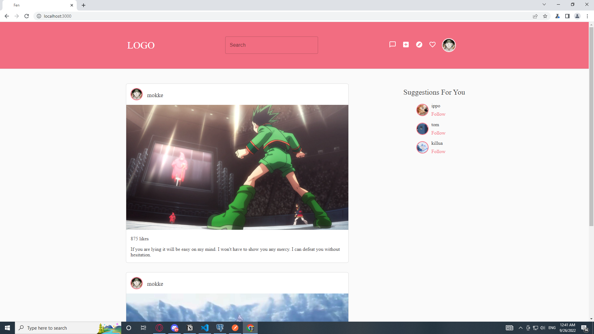

# Social media application

An application that allows users to build their own profiles, view others profiles, share posts and search for content/posts that they are interested in.

Working features:

- creating, viewing profiles
- creating, viewing posts
- following, unfollowing profiles

## Technology stack

### TypeScript

A superset of JavaScript that allows the use of static typing, interfaces and classes. Developed by Microsoft.

### React

Front-end JavaScript library for building user interfaces based on UI components.

### Redux

An open-source JavaScript library for managing and centralizing application state.

### Python

A high-level, general-purpose programming language, it's dynamically-typed and garbage-collected.

### Flask

A micro web framework written in Python.

### SQLAlchemy

Object-relational mapper for the Python

### PostgreSQL

Relational database management system.
